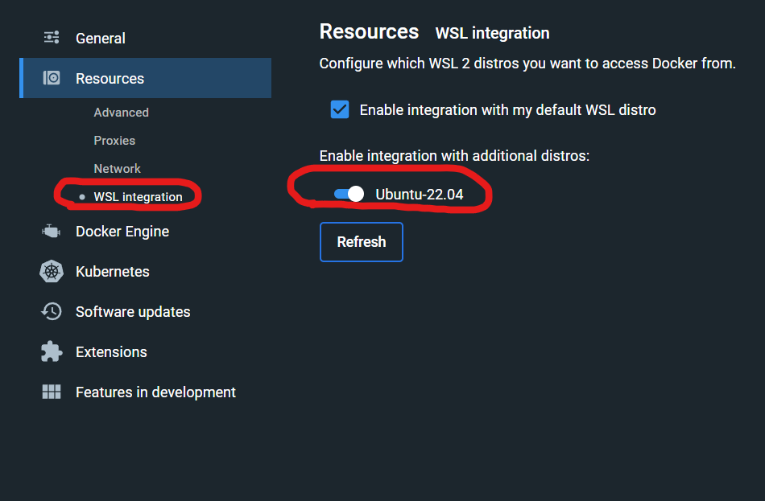

# Karateca

## Installation

Running this application requires Docker.

In a nutshell, installation steps are:
* clone repository.
* install dependencies 
~~~ shell
docker compose up composer_update
~~~
* `docker compose up`

### Linux caveats

* Works with commands above. Depending on configuration might require `sudo`

### Windows caveats

Performance on Windows systems will be very slow unless repository resides inside a WSL image.
* Install Ubuntu from the Microsoft store
* Write `\\wsl.localhost\` in the explorer address bar to access wsl filesystem.
* Navigate to the Ubuntu filesystem
* clone there
* Configure Docker to use WSL2
* Configure Docker to access the Ubuntu image

You probably want to use your current GIT installation rather than the one that comes with Ubuntu.
Make sure to configure your IDE to use your default git on windows, perhaps `C:\Program Files\Git\bin\`

Git might complain about repository ownership. To soothe its worries run this on the host machine, not the container:

~~~ shell
git config --global --add safe.directory '%(prefix)///wsl.localhost/Ubuntu-22.04/PATH_TO_REPOSITORY'
git config --global --add safe.directory '%(prefix)///wsl$/Ubuntu-22.04/PATH_TO_REPOSITORY'
~~~

Or

~~~ shell
git config --global --add safe.directory '*'
~~~

Or just configure git on the Ubuntu machine: keys, gpg, GitHub, etc...

External: [Docker desktop wsl2 best practices](https://www.docker.com/blog/docker-desktop-wsl-2-best-practices/)

## TODO:

* [x] Delete song
* [ ] Reorder playlist - need string keys for array_splice to preserve indices. Will reorder by splicing: move(fromPosition, toPosition)
* [ ] 