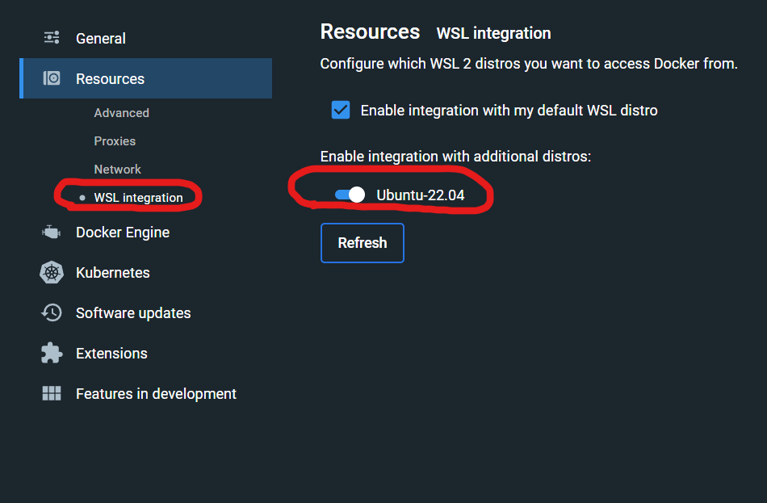

# Karateca

## Installation

Running this application requires Docker.

In a nutshell, installation steps are:
* clone repository.
* install dependencies 
~~~ shell
docker compose up composer_update
~~~
* `docker compose up`

### Linux caveats

* Works with commands above. Depending on configuration might require `sudo`

### Windows caveats

Performance on Windows systems will be very slow unless repository resides inside a WSL image.
* Install Ubuntu from the Microsoft store
* Write `\\wsl.localhost\` in the explorer address bar to access wsl filesystem.
* Navigate to the Ubuntu filesystem
* clone there
* Configure Docker to use WSL2
* Configure Docker to access the Ubuntu image

You probably want to use your current GIT installation rather than the one that comes with Ubuntu.
Make sure to configure your IDE to use your default git on windows, perhaps `C:\Program Files\Git\bin\`

Git might complain about repository ownership. To soothe its worries run this on the host machine, not the container:

~~~ shell
git config --global --add safe.directory '%(prefix)///wsl.localhost/Ubuntu-22.04/PATH_TO_REPOSITORY'
git config --global --add safe.directory '%(prefix)///wsl$/Ubuntu-22.04/PATH_TO_REPOSITORY'
~~~

Or

~~~ shell
git config --global --add safe.directory '*'
~~~

Or just configure git on the Ubuntu machine: keys, gpg, GitHub, etc...

External: [Docker desktop wsl2 best practices](https://www.docker.com/blog/docker-desktop-wsl-2-best-practices/)

## TODO:

* [x] Delete song
* [x] Reorder playlist by splicing to preserve indices
* [x] Make `YoutubeSong` not know the singer and make separate class for `PlaylistSong` which contains it.
* [ ] Make GUIDs strings  
      **_OR_** use `ds/Map` extension to be able to array-access objects as keys 
      **_OR_** use `ds/Hashable`
* [ ] Investigate using `ds/Sequence` for storing PlaylistSongs.  
      Breaks access by ID since requires int keys.  
      Has native functions for inserting songs at specified index
* [ ] Run functional tests on separate redis container to prevent accidental interference.  Temporarily using separate redis db.

~~~ mermaid
---
title: Class Diagram
---
classDiagram

    ApplicationUser --|> PartyStorage: uses
    ApplicationUser --|> Party: uses
    
    RuntimePartyStorage ..|> PartyStorage: implements
    RedisPartyStorage ..|> PartyStorage: implements
    
    ApplicationUser ..|> Host: implements
    Party "1" o-- "0..*" PartySong
    
    Party --|> Host: has
    
    PartyStorage "1" *-- "0..*" Party: contains
    
    namespace Infrastructure {
        class RuntimePartyStorage
        class RedisPartyStorage
    
        class ApplicationUser {
            throwParty()
            deleteParty()
            listParties()
            enqueueSong()
            deleteSong()
            listSongs()
        }
    }
    
    namespace domain {
        class Host {
            <<interface>> 
        }
        class Party {
            host: Host
            id: 
            addSong(): void
            deleteSong(): void
            moveSong(): void
        }
        class PartySong {
            id
            YoutubeSong
            singer
        }
        class PartyStorage {
            <<interface>> 
            playlists: Party[]
            addParty() : void
            deleteParty(): void
            getParty(): Party
            listParties(): Party[]
            storeParty() : void
        } 
    }
    
    note for PartyStorage "Does the storage\nvia storeParty()\nOR via each action"

~~~